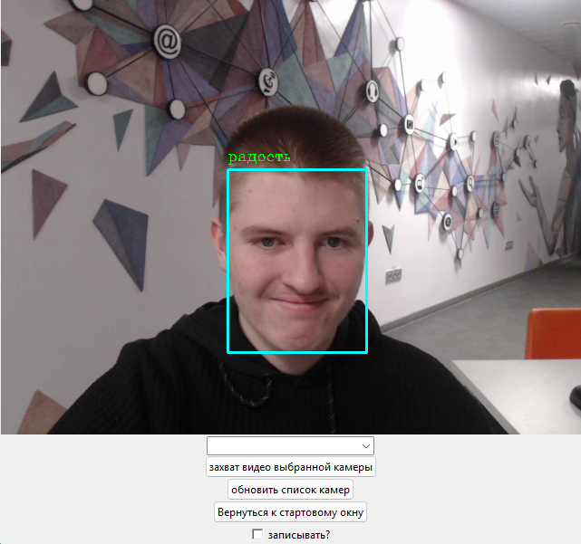

# VAN

Система анализа видео и классификации эмоций

Возможности:
- анализ эмоционального состояния человека с применением нейронных сетей
- подключение к реальным и виртуальным (через OBS-studio) камерам
- сохранение видео и логирование результатов анализа

Информация о версиях:

Третий релиз системы (V3), пока в разработке.
- изменён алгоритм захвата лиц
- идёт работа над распознаванием эмоций по аудио (результаты - в папке SpeechToEmotionBeta)

Второй релиз релиз системы (V2).
- добавлен визуальный интерфейс 
- повышено качество распознавания (доработана и дообучена модель тех. зрения)
- решены проблемы с отказоустойчивостью (отключение камеры в момент работы системы, прерывание связи, и.т.д... теперь отрабатываются и не приводят к аварийному завершению работы)
- добавлена система логирования
- система запускается в один клик через ".exe" файл

Первый релиз системы (V1). 
- запуск через командную строку
- распознавание на основе видео

УСТАНОВКА ДЛЯ V2 (актуальня версия):

Скачайте и распакуйте system_V2.zip отсюда https://drive.google.com/file/d/1-ipD2wqe5IcrSXBYxmotU-zQh8W2rIym/view?usp=sharing.
Запустите файл interface_classes.exe
Подождите несколько секунд пока система запускается.

УСТАНОВКА ДЛЯ V1 (устаревшая версия):
Система протестирована на Windows.
На данный момент система запускается из консоли. 
Для нормальной работы требуется Python версии 3.9. При установке поставьте галочку Add Python to PATH.
Для загрузки библиотек требуется Pip, устанавливается автоматически вместе с Python 3.9

Желательно запускать систему из Venv во избежании проблем с совместимостью.

Создание Venv на Windows:
  1) скачайте архив system_V1.zip отсюда, распакуйте его в удобное вам место.

  1)откройте коммандную строку
  
  2)введите сd /ваш/путь/к/папке/system
  
  3)введите "python -m venv ." без кавычек
  
  4)введите cd scripts

  5)введите activate

Venv активирован.
Не закрывайте окно cmd!

Перед запуском cbcntvs внутри Venv нужно установить: 

- pip install opencv-python
  
- pip install ultralytics

в cmd перейдите к расположению файла main.py
введите python main.py

Система запущена.

ctrl c в cmd для остановки работы.
